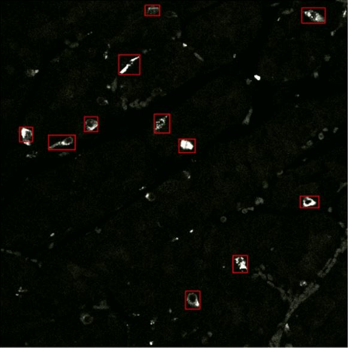

# R-CNN for Cell Detection and Counting Tool

The standard way to quantify biological imaging results is to count manually the number of each cell type in each image.
This manual counting is labor-intensive and often inconsistent. To do the counts automatically and deterministically, 
I used a deep learning model (R-CNN). The main goal of this R-CNN is to be able to replace any lab worker to 
create much faster and more reliable results. To create the data I also developed a counting tool.

The repository includes:
* Code for counting tool.
* Training code on biological data.
* Pre-trained weights of MS COCO for transfer learning.
* Code for detect cells in new images.
* Code for Evaluation the results (AP).
* Source code of Mask R-CNN built on FPN and ResNet101.

# Counting Tool
In my study, I performed immunohistochemistry staining of biopsies taken from human stomachs. Therefore, the data 
consists of images while each image consists of three channels- blue, green, and red where each represents a different 
cell type. The main goal is to count the number of cell in each of the channels.

For example, in this image, the blue channel represents cells expressing CHGA/SYP, the red channel represents cells 
expressing TPH1/5HT and the green channel represents cells expressing HDC. The purple cells represent cells expressing
both CHGA/SYP and TPH1/5HT.

To create the data for the R-CNN, I created a tool called counting tool. This tool allows the cells in the images to be 
easily counted because it provides most of the functions required for correct counting, such as by marking the 
bounding box on the image, changing the brightness and the contrast of the image, and facilitates a convenient 
transition between all channels. In addition, the results are saved in such a way that they can later be used by the 
R-CNN.

The counting tool:

The tool displays two windows; one window presents the name of the image as well as the image itself, while the second 
window is the control window which allows the transition between the channels. The user can activate the channels of 
the image by left-clicking the control window. The blue background color represents a channel currently displayed in 
the image.

For example, while only the blue channel is selected in the control window, in the image window, the image only 
displays the blue channel, while in the control window, only the blue channel is displayed with a blue background.
In addition, two cells marked by the user by a bounding box.

# R-CNN for Cell Detection
All the results obtained from the counting tool were transferred to the R-CNN model which generates bounding boxes for 
each instance of an object in the image. The images i used were in black-and-white and represent only a blue, red, or 
green channel. Each image was tagged according to the relevant channel.
Because the amount of data was not very large (750 images), I used transfer learning (using a pre-trained weights for 
MS COCO object detection dataset) to achieve faster and more accurate learning without overfitting but the 
learning can also be from scratch.

The images following displays marked cells in a given image. The image on the right is the network’s prediction. 
The image on the left contains the actual tagging done by a lab worker.

The image following displays marked cells in new images therefore there is no actual labeling. 

# Getting Started
* [demo.ipynb](samples/demo.ipynb) Is the easiest way to start. It shows an example of using a model pre-trained on MS COCO to segment objects in your own images.
It includes code to run object detection and instance segmentation on arbitrary images.

* [train_shapes.ipynb](samples/shapes/train_shapes.ipynb) shows how to train Mask R-CNN on your own dataset. This notebook introduces a toy dataset (Shapes) to demonstrate training on a new dataset.

* ([model.py](mrcnn/model.py), [utils.py](mrcnn/utils.py), [config.py](mrcnn/config.py)): These files contain the main Mask RCNN implementation. 

* [inspect_data.ipynb](samples/coco/inspect_data.ipynb). This notebook visualizes the different pre-processing steps
to prepare the training data.

* [inspect_model.ipynb](samples/coco/inspect_model.ipynb) This notebook goes in depth into the steps performed to detect and segment objects. It provides visualizations of every step of the pipeline.

* [inspect_weights.ipynb](samples/coco/inspect_weights.ipynb)
This notebooks inspects the weights of a trained model and looks for anomalies and odd patterns.

## Requirements
Python 3.4, TensorFlow 1.3, Keras 2.0.8 and other common packages listed in `requirements.txt`.

